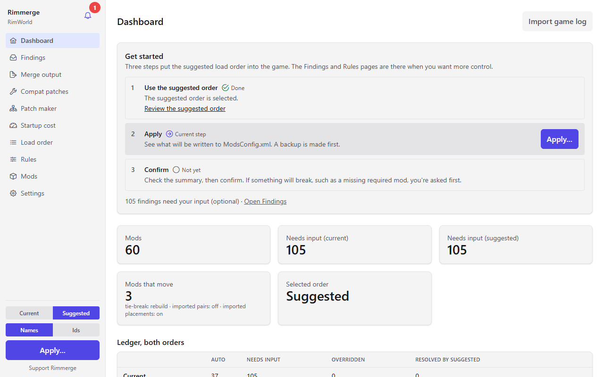
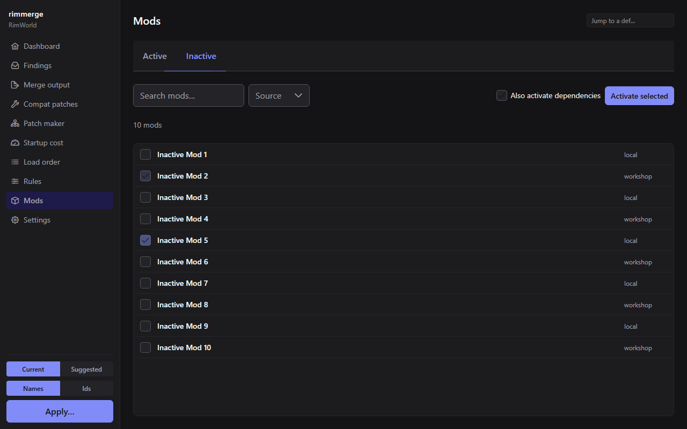

# Rimmerge

[](https://github.com/Rimmerge-Project/rimmerge/actions/workflows/ci.yml)
[](https://github.com/Rimmerge-Project/rimmerge/releases)
[](#license)

[](https://buymeacoffee.com/nephilim)

Rimmerge sorts a RimWorld mod list into a conflict-aware load order and
tracks every conflict it finds — dropped dependency edges, def
overrides, patch collisions, duplicate assemblies, incompatible pairs,
and more — in a resolution ledger you work through once, whose
decisions persist across re-scans. Where two mods genuinely disagree, it
can generate a merge patch that keeps both mods' changes instead of
picking a winner. It ships as a CLI and a Tauri desktop app, both thin
shells over the same engine.



*The dashboard on a synthetic mod list: Suggested selected, Apply is the current step, and the tiles compare it with Current.*



## Install

Rimmerge builds and ships for Windows only. See
[docs/install.md](docs/install.md#getting-rimmerge) for how to get it
(portable zip release, or build from source) and how it finds your RimWorld
install, Steam Workshop folder, and `ModsConfig.xml`.

## Quickstart

Four steps, CLI shown here — the desktop app does the same thing with
buttons instead of flags:

```sh
# 1. Scan: read-only, writes a report into a profile directory.
rimmerge load --profile-dir <profile>

# 2. Review the inbox: one finding per thing worth a decision.
rimmerge ledger --report <profile>/report.json --status needs-input

# 3. Preview a suggested order from the report alone, without your
#    decisions or rules (a quick look, not what `apply` will use).
rimmerge sort --report <profile>/report.json

# 4. Apply: re-derives the order from the profile's real rules and
#    decisions (not the bare preview above) and is the one command
#    that can write ModsConfig.xml. It writes the suggested order by
#    default and lists any hard problems in it first.
rimmerge apply --profile-dir <profile> --dry-run   # preview only
rimmerge apply --profile-dir <profile>              # writes it
```

Full walkthrough, including the desktop app's own pages:
[docs/quickstart.md](docs/quickstart.md).

## Architecture

```
apps/cli, apps/desktop/src-tauri
        |
    rim-session
        |
    rim-merge
        |
   rim-resolve
        |
rim-analyzer::domain
```

`rim-io` implements `rim-session`'s ports — every real filesystem,
`ModsConfig.xml`, RimSort-import, and network adapter lives there.
`rim-resolve`, `rim-merge`, and `rim-analyzer::extract` do no IO at all;
`apps/*` are composition roots with no business logic of their own. Full
breakdown, including where new code belongs:
[docs/architecture.md](docs/architecture.md).

## Safety guarantees

- **Read-only by default.** Scanning, sorting, building the ledger, and
  `verify` never write anything.
- **Every write is something you explicitly asked for.** `apply` and
  `mods activate`/`mods deactivate` write `ModsConfig.xml`.
  `apply --write-merge-mod`, and `patch export`/`assign export` with
  `--install`, additionally write a generated mod folder under
  `<your RimWorld install>/Mods` and add its package id to
  `ModsConfig.xml`. Nothing writes anywhere else.
- **A backup first, every time.** Every `ModsConfig.xml` write takes a
  timestamped backup before it touches the file; a merge-mod write keeps
  the previous generation's own folder as a one-deep backup too.
- **Nothing writes while RimWorld looks like it's running**, unless you
  pass `--force` (CLI) or confirm past the same warning (desktop) — the
  game overwrites `ModsConfig.xml` on its own exit, so a concurrent
  write risks being lost or corrupting the running copy.
- **Two GitHub hosts, on by default and explained on first launch, one
  switch to turn off.** The only outbound connections this tool ever
  makes are to `raw.githubusercontent.com` (the rule databases) and
  `api.github.com` (a release-version check) — the desktop app checks
  both automatically, at most once a day, but never before its
  first-run notice is answered, and never before you can turn it off;
  the large Steam Workshop database is on by default but never fetched
  automatically, only by a manual Refresh click, `rimmerge db refresh`, or
  the recommended-databases notice's "Turn on and download" button; the CLI
  never contacts either on its own. One switch skips every
  request entirely (no URL built, no socket opened), automatic or
  manual. See [docs/privacy-and-network.md](docs/privacy-and-network.md).
- **Deterministic output.** The same install and the same rules always
  produce the same report and the same suggested order — no hidden
  state, no iteration-order dependence.

## Documentation

- [docs/install.md](docs/install.md) — finding your RimWorld install
- [docs/quickstart.md](docs/quickstart.md) — scan, review, sort, apply
- [docs/cli.md](docs/cli.md) — every CLI subcommand
- [docs/desktop.md](docs/desktop.md) — the desktop app, page by page
- [docs/settings.md](docs/settings.md) — every setting, and whether it
  changes the sorter's output
- [docs/concepts/load-order.md](docs/concepts/load-order.md) — how
  RimWorld itself decides load order
- [docs/concepts/sorting.md](docs/concepts/sorting.md) — tiers, edge
  strengths, tie-breaks, the full precedence order
- [docs/concepts/ledger.md](docs/concepts/ledger.md) — findings,
  confidence, decisions
- [docs/concepts/verify.md](docs/concepts/verify.md) — predicting patch
  failures before you launch the game
- [docs/concepts/merge.md](docs/concepts/merge.md) — the merge mod,
  compatibility patches, and the patch maker
- [docs/concepts/rules-databases.md](docs/concepts/rules-databases.md)
  — RimSort import and this project's own rule database
- [docs/testing.md](docs/testing.md) — for contributors: the
  real-install test tier and the synthetic fixture
- [docs/troubleshooting.md](docs/troubleshooting.md) — common problems

Full index, including reference pages not listed above:
[docs/README.md](docs/README.md).

## Contributing

See [CONTRIBUTING.md](CONTRIBUTING.md) for the build, the gates, the
layering rule, and where a mod-specific finding belongs instead of this
repo.

## Support

Rimmerge is free and open source. If it saves you time, you can support
its development on [Buy Me a Coffee](https://buymeacoffee.com/nephilim).
Bug reports, rule contributions, and translation fixes help just as much.

## Security

See [SECURITY.md](SECURITY.md) to report a vulnerability privately, and
for the network/filesystem guarantees stated formally.

## License

Licensed under either of Apache-2.0 or MIT at your option. Unless you
explicitly state otherwise, any contribution intentionally submitted for
inclusion shall be dual licensed as above, without additional terms or
conditions.
