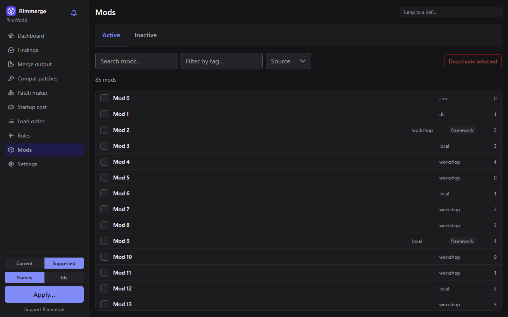
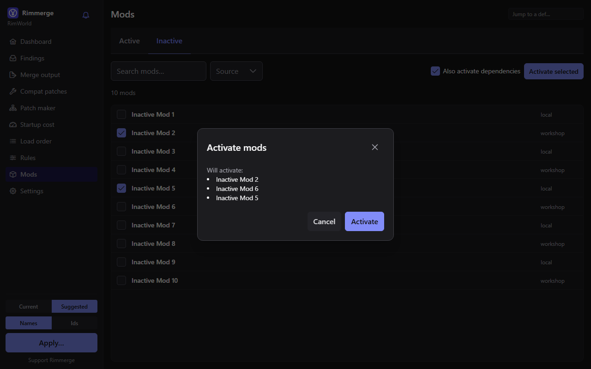
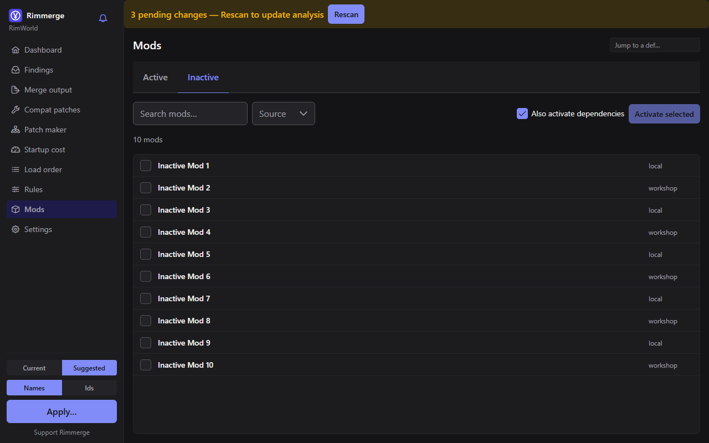
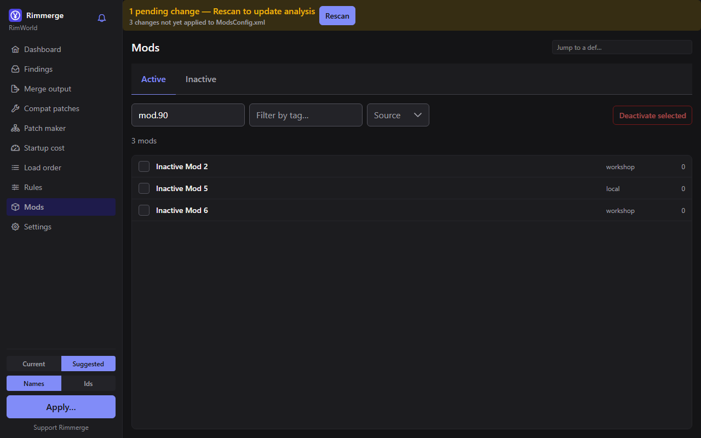
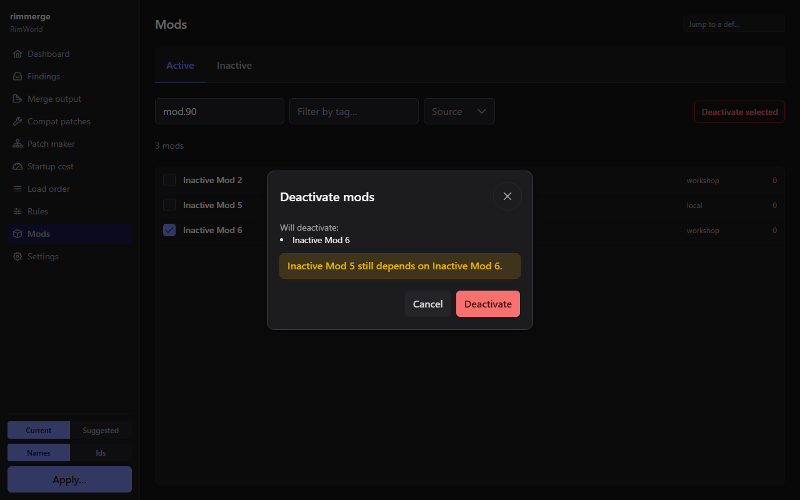
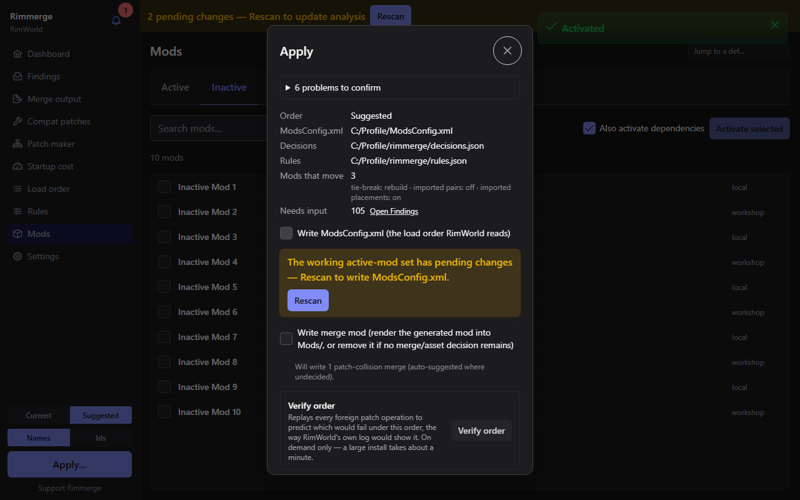
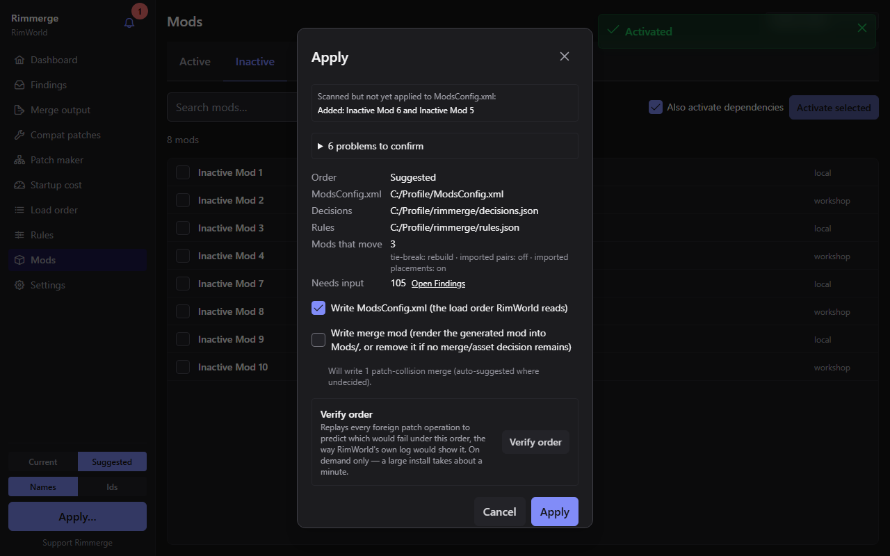
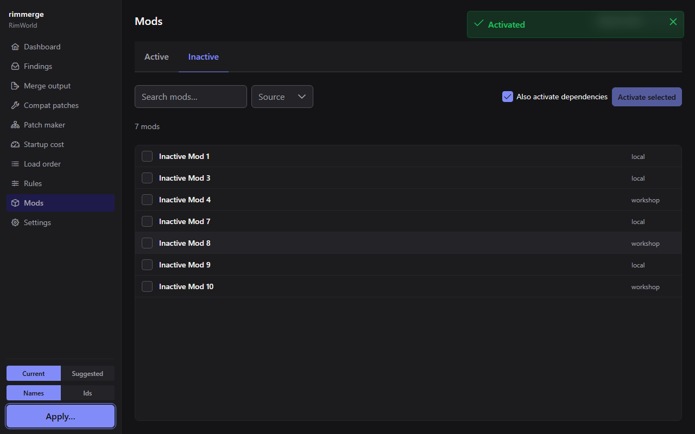

# Desktop app

A Tauri + Vue desktop shell over the same engine the CLI uses — nothing
in the app calls Rimmerge's own logic differently than the CLI does; it
just gives it a UI.

## Setup

The first thing you see if no path is pinned yet
(`config.json` is empty or missing — see [install.md](install.md)).
Lets you point the app at your RimWorld install, workshop folder, and
`ModsConfig.xml` directly, or confirm what auto-detection found.

## Dashboard

The landing page once a profile is open: a getting-started strip, then a
summary of the current report — active mod count, open findings by kind,
and quick links into the pages below.

The strip has four steps: get the recommended rules, use the suggested
order, Apply, confirm. Each step's state is read from what the app
already knows (which order is selected, whether `ModsConfig.xml` already
lists the suggested order, whether the active-mod set has changes no
rescan has picked up, and what the recommended-rules step below reports),
so nothing about your progress is stored, with one exception: Skip on step
one. It does not claim you reviewed the
suggestion; it links to the Load order page and leaves that to you.
"Done" means `ModsConfig.xml` matches the suggested order as of the last
scan or apply, and no activation change is waiting for a rescan. While the
working set is stale, step two offers Rescan instead of Apply, even if the
file matched at the last scan. The number of findings that still need input appears as
a quiet line with a link to the Inbox; it never blocks Apply.
Once every step is done the strip ends with a **Launch RimWorld** button, the
same one the sidebar shows under Apply (see
[Launching RimWorld](#launching-rimworld)).

**Step one, Get the recommended rules,** downloads the two importable
rule databases (the community load-order rules and the Steam Workshop
database) and imports them into this profile, so the suggested order you
review next already uses them. It never runs on its own: nothing happens
until you click, and the step lists, before you do, what the click will do
for each source (turn it on and download it, download it, or import the
copy already downloaded). The button names the size, about 49 MB, only
when the Steam Workshop database has to be downloaded; it reads **Try
again** when a download failed last time, and **Import** when only an
import is left. The click downloads only the sources that are switched off or not downloaded yet, never imports a
source this profile already imported, and never touches your own RimSort
`userRules.json`. A progress line names the source being downloaded, with
a note that the Steam Workshop database can take a few minutes on a slow
connection, and a message afterwards says what happened: everything
imported, some downloads failed (what did download was imported), nothing
could be downloaded, there was nothing to do (an already-finished step
clicked again), the import failed (one sentence says whether the downloaded
file could not be read or the rules could not be saved, with the technical
details underneath), the import record could not be saved (click again),
or another profile was opened meanwhile.

The step is one of five states. **Offered** holds the strip on step one
until you act (importing changes the suggested order, so even a matching
`ModsConfig.xml` does not read as finished while the step is offered).
**Not available** appears when something has to be downloaded but
internet access is off (with a link to Settings) or the first-run notice
on the Dashboard is not answered yet; it never holds the strip, which
moves on to step two. A step that only needs an import ignores both
gates, since importing contacts nothing. **Skipped** is what **Skip**
leaves: remembered for this profile, the strip moves on, and a **Get them
now** button stays. The skipped row lists what the click would do for each
source, exactly as the offered row does, and the button names the size
(about 49 MB) when the Steam Workshop database would be turned on and
downloaded, so nothing is switched on or downloaded without being said
beforehand. While internet access is off or the first-run notice is
unanswered, a click that needs a download is refused with a message
saying which. **Done** means every importable source has been
imported into this profile at least once; newer downloaded content is the
job of the "New rule content to import" notice, not of this step. While a
click is running the step shows its progress, in every window, and a
second click is refused. The Rules page's Databases card remains the
other way to download, then import.

A project opens on the **suggested** order, the one Apply writes by
default. The Current/Suggested switch in the app shell changes which
order the pages show and which one Apply writes; the choice is not
saved, so the next load opens on Suggested again. A rescan keeps the
order you had selected. Apply writes the order named in the dialog's
"Order" row, which is sent with the request.

The app can also list the **hard problems** in the order Apply would
write: a required mod that is not active, two active mods declared
incompatible, a mod in `ModsConfig.xml` that is not on disk, a violated
hard load requirement, or an unmet load-time any-of (see [the ledger
page](concepts/ledger.md#hard-problems-at-apply)). Each carries whether
you already decided its finding in the Inbox.

In the Apply dialog, a "N problems to confirm" row lists them. Clicking
Apply while any is still undecided replaces the buttons with an "Apply
anyway?" panel: the undecided problems, the ones already decided in the
Inbox (listed apart), a link to the Inbox, and **Go back** (focused) and
**Apply anyway**. If every problem was already decided, nothing is asked.
With "Write ModsConfig.xml" unchecked, nothing is written there, so it skips the question.
If RimWorld looks like it is running, a separate "Write anyway" prompt
comes after this one; the two are never one button.

## Launching RimWorld

The **Launch RimWorld** button sits in the sidebar under Apply, and again at
the end of the Dashboard strip once its steps are done. It starts the game;
Rimmerge stays open.

**How the game is started.** A Steam copy is started through Steam
(`steam://run/294100`), so Steam's own launch settings apply. Any other copy
(GOG, a standalone folder) starts `RimWorldWin64.exe` directly from the
install folder, with no arguments. A copy counts as a Steam copy only when
Steam's own record names that folder: the folder sits in a library's
`steamapps/common`, the library's `appmanifest_294100.acf` names it, and the
library is listed in a default Steam root's `libraryfolders.vdf`. A folder
copied out of Steam, or a backed-up library, is not mistaken for the real one
(Steam would start a different folder). A Steam copy whose Steam is installed
outside the default Program Files folders is started directly through
`RimWorldWin64.exe`, since its library cannot be found.

**What the button says.** It reads from the **selected** order and the last
scan or apply, the same caveat as the strip: an edit made to `ModsConfig.xml`
by another tool since then is not seen until a rescan. The status refreshes
every five seconds while the window is visible, and when you come back to it.

- **Launch RimWorld** (enabled): a click starts the game, then the button
  reads **Starting RimWorld…** until the game shows up in the process list
  (or 30 seconds pass). The sidebar and strip buttons share that state, so
  a click on one disables the other and a second click cannot start the game
  twice.
- **Apply first?** When `ModsConfig.xml` does not hold the order you are
  looking at (or activation changes are waiting for a rescan), a click asks
  first, with **Cancel** (focused), **Launch anyway** and **Apply first**.
  Apply first opens the ordinary Apply dialog with all its usual
  confirmations and, once it has written `ModsConfig.xml`, launches. If you
  uncheck "Write ModsConfig.xml" there, or close the dialog, nothing is
  launched.
- **RimWorld is running** (disabled): the game is already up.
- **Disabled with a note**: the install has no `RimWorldWin64.exe`, or the
  status check failed (a short line says so). Until the first answer arrives
  the button is disabled with no note. After that it shows the last answer,
  and a click first waits for a fresh one, which can wait behind a long
  command such as Verify; the button stays disabled meanwhile rather than
  guessing.

Launching writes nothing: no file, no setting. The only write on this path is
the Apply you may choose in the prompt. If Steam's links are not set up on the
machine, Windows may show its own prompt instead of Rimmerge reporting an
error. Rimmerge opens no connection to start the game (see
[privacy and network](privacy-and-network.md)).

## Inbox

The ledger, one row per finding. See
[concepts/ledger.md](concepts/ledger.md) for the model behind it —
every row here is a `Finding`, carries a suggested `Action` and a
confidence score, and can be filtered/searched. Deciding a finding here
is what a later sort/apply will honor.

## Order (`/order`, `/order/:modId`)

The suggested load order, with a why-panel: click any mod (or open
`/order/:modId` directly) to see the edges that placed it where it is —
which mod it must follow, why, and how strong that requirement is. See
[concepts/sorting.md](concepts/sorting.md).

### Sharing a load order

The page header has two menus. **Export** writes the order that is in
`ModsConfig.xml` now, which is what RimWorld loads, and not the order the
page is showing (the app opens on Suggested, which you may never have run).
*Save as RimWorld mod list (.rml)…* opens the save dialog in RimWorld's own
`ModLists` folder when it exists, so the game's "Load list" finds the
file; only a `.rml` name is accepted. *Copy as text* puts a numbered list
on the clipboard for a chat message. A mod Rimmerge cannot list is left out
and the toast says how many.

**Import** takes a `.rml`, a `ModsConfig.xml`-shaped file or a text list,
from a file or a paste, and always shows a preview first. The preview names
what will be activated and deactivated (the list is the whole active set;
Core is never deactivated), the mods that aren't installed (with an *Open on
Steam Workshop* button where the list knows the item; Rimmerge never
downloads anything, and *Copy the missing list* gives you the text to ask a
friend), mods listed twice, mods matched to another copy of themselves, and
lines that were not understood. A file that can't be read as a list shows its
reason and offers no import. *Use this order* is enabled only when the
backend says the order can be imported; when it is disabled the preview
says why (Core isn't installed, none of the listed mods is installed, the
order would be too long, or it names a mod that isn't installed or names
one twice). A list that leaves Core out is not refused: Core is kept first. If your installed mods change between the preview and the
click, the import is refused, the preview closes and a notice asks you to
preview the list again.

Importing rescans with the previewed order and selects **Current**: the page
then shows the imported order with a note that it isn't in `ModsConfig.xml`
yet, and an Apply button. The preview closes as soon as the scan lands; pages
then refresh in the background. Nothing is written until you Apply, and the normal
Apply dialog (hard-problem confirmation, running-game check, backup) is the
only writer. An import replaces activation changes you haven't rescanned and,
if the Current order is not in the file yet, that order; the preview warns
about each.

## Mods (`/mods`, `/mods/:modId`, `/mods/:modId/details`)

Lists every discovered mod — active, inactive, or both — and lets you
activate or deactivate mods. A change is staged in the app, not written
to `ModsConfig.xml`: it reaches the file's `<activeMods>` list only when
you Rescan and then Apply. Until then a pending-changes banner shows it,
and a stale-order warning appears once the active set no longer matches
the order you last built.
`Activate` can pull in a mod's own declared dependencies first.

Opening a row from either tab (`/mods/:modId` — inactive mods can be
opened too, not just active ones) shows a mod info panel beside the
list: its preview image and icon when the mod ships one, its `About.xml`
description (rendered as plain text — BBCode and any other markup show
up literally, exactly as RimWorld itself displays an unrecognized tag),
workshop and homepage links (opened in your system browser, never
inside the app), and — for an active mod — its placement, tier, tags,
dependents, and live findings, with a link into the def inspector for
what it changes. The panel follows your keyboard focus as you move
through the list (debounced, so arrowing quickly through rows doesn't
fire a load per row) and closes when you navigate away. `Esc` or the
close button also closes it. The panel's own "all details" link opens
the same information as a full page (`/mods/:modId/details`) instead,
for when you want it as the main view rather than a side panel.

The CLI's `mods show <id>` prints the same information from the command
line — see [cli.md](cli.md).

Selecting inactive mods to activate:

Activating pulls in dependencies on request:

Pending changes are never silent:

Two kinds of pending change stack into one banner:

Deactivating warns about anything that still depends on the mod:

Applying a stale order (the active set changed since the order was
built) is flagged before you can proceed:

Rescanning brings everything back in sync:

## Rules

Every rule feeding the sorter — your own pair/placement rules, and (if
imported) rules from a RimSort database — with edit and delete actions
and, for an imported rule, a "promote to mine" action so it survives a
re-import. See [concepts/rules-databases.md](concepts/rules-databases.md).

## Def inspector (`/defs/:defRef`)

Everything about one def or template: which mods contribute to it,
every patch operation touching it, its template inheritance chain, and
the merged (effective) def under the current order.

## Merge editor (`/merge/:key`)

One finding's field-level diff and merge plan: pick which mod's value
wins per field, or accept the auto-merge where every candidate order
agrees. Feeds the merge mod (see [concepts/merge.md](concepts/merge.md)).

## Merge mod (`/merge-mod`)

The generated compatibility mod covering every finding you've resolved
with a merge decision — its own coverage summary and an export action.

Deciding a merge does not put anything in your `Mods/` folder. The Apply
dialog's **Write merge mod** checkbox starts unchecked (like the CLI's
opt-in `apply --write-merge-mod`), even when complete merges exist: tick
it to render the generated mod into `Mods/` (or remove it when no merge
or asset decision remains). Your choice holds until you close the dialog,
and the dialog starts unchecked again the next time it opens. An apply
without it still saves your decisions and writes `ModsConfig.xml`, but
leaves any merge mod already in `Mods/` as it was, so it can lag behind
decisions made since. The dialog works out what the merge mod would contain
when it first opens and again after the session changes (a swap, a decision,
a rescan), which takes a few seconds on a large install; reopening it with
nothing changed reuses the last answer, so a merge-mod folder added or removed
on disk outside the app is picked up at the next such change. Until the
answer arrives, the section reads "Loading…" and the checkbox is disabled, so it never shows a
previous session's answer. If that lookup fails, the section simply shows
no summary, never a previous session's.

## Compatibility patches (`/patches`, `/patches/:patchId`, `/patches/:patchId/merge/:key`)

A patch project is a user-chosen scope of two or more mods with its own
decisions, exported as a small, independently publishable mod — the
same underlying engine as the merge mod, scoped down. A patch's own
findings open the same merge editor the profile-wide one uses
(`/patches/:patchId/merge/:key`), just validated against that patch's
own narrower scope instead of the whole install. See
[concepts/merge.md](concepts/merge.md).

## Assignments (`/assignments`, the patch maker)

The patch maker: infers a reference-mod-to-target-mod assignment
schema (e.g. "which of these fields does a race-support mod need per
race?"), then a row-editor UI to fill in and export one `Defs/`-only
mod per project. `/assignments/new` is the creation wizard;
`/assignments/:assignmentId` is the row editor itself, one tab per
section for a project covering more than one def type.

### Seeing a def's texture

A target def shows what it looks like, so you can tell which race or item
a row is for without opening the game.

- **Queue thumbnails.** Each row of the coverage queue has a 40 px
  preview of the def's default view. Rows load their preview only when
  they are within a short distance of the visible part of the list's own
  scroll area, and let it go again some
  seconds after they scroll away. A preview is decorative: the row's text
  still names the def.
- **The viewer.** Selecting a row shows a 160 px viewer at the top of the
  row editor (not for a free-standing "new def" row, which has no def on
  disk). Its controls:
  - **Facing** (N, E, S, W), for a directional graphic. It starts on south;
    arrow keys move between the four. A west side drawn from the east
    file, mirrored (which the game does only when the graphic allows
    flipping), says so.
  - **Variant**, previous and next, for a def with several textures (a body
    type, a life stage, a collection member). Past eight variants it is a
    dropdown.
  - **Source**, a dropdown shown only when the def has more than one place
    its textures come from (the graphic, an icon, a pawn kind that uses
    the race, and so on).
  - A line names the mod whose file is shown, and flags it when that mod
    is not the def's owner (a retexture replacing the owner's art).
- **Item picker.** Each def in an item picker has a 24 px preview too; the
  project's own new rows have none, since they are not on disk yet.

What is shown is what the game would load under the selected order: the
def's effective data (after patches) decides the texture path, and the
last-loaded mod shipping that path wins. When there is nothing to show,
the viewer says why rather than leaving a blank:

- the texture is built into the game or an asset bundle, which
  Rimmerge cannot read (or it was found nowhere, and might be);
- no file exists, so the game would show its error texture;
- the game loads a `.dds` file: if a PNG or JPEG sits beside it, that
  copy is shown and labelled; otherwise there is no preview, and a `.dds`
  the game cannot decode is called out;
- the file is too large or not a supported image;
- the def shows no texture of its own, or is a humanlike race the game
  assembles from body, head and hair parts at run time.

Some graphics are found by path rather than by a rule of the game (a
field whose text names texture files): those are labelled as such and are
approximate. Nothing here changes the load order, a finding or an export.

## Startup

The per-mod startup-cost table (patch operation counts, slow-shape
xpaths, texture/DLL counts and bytes), plus, once you've imported a
`Player.log`, real per-mod timing next to the static estimate.

### Importing a game log

The **Import game log** button (here and on the dashboard) reads a
`Player.log` or an in-game console snapshot (a copy of the debug
console, saved under any name; the picker lists `.log` and `.txt` files
first and offers all files). The kind comes from the file's content,
never its name, and the result is never cached or written anywhere. The
summary under the button says what the file is and what it covers, in
the same terms as the CLI's `log import` ([cli.md](cli.md)):

- **Kind**: `Player.log` or console snapshot.
- **Coverage**, one line. A `Player.log` gives its startup passes and
  how it ends: a clean exit, a crash (with the crash report location the
  log prints), or cut off with no exit footer (a freeze, a force-close,
  or a copy taken while the game ran). A snapshot says it holds only the
  entries the console held; when it is at the console's cap the game
  dropped the older entries, and when it is over the cap it is several
  copies pasted together (or a parsing problem). A copy that starts
  mid-entry says so.
- **Logging gaps**: a warning when the game stopped writing messages
  (after 10,000 messages it stops until it resumes): how many gaps, how
  many never resumed (everything after one is unreliable), the gaps as
  line ranges, and the share of the log's entries in families that span
  a gap, whose counts may be short.
- **Read losses**: a warning when the reader had to bound something,
  one line per non-zero counter of the CLI's `read_stats` (over-long
  lines, invalid UTF-8, unlisted gaps, cut crash-report paths, and so
  on), with each count.

The gap list shows the first 5 gaps and "and N more" (the total includes
gaps the reader counted but did not list; the CLI lists 10). The share
of entries in families that span a gap is never shown as 0% or 100%
while part of the log lies outside it.

A snapshot is never presented as a whole session. Some counts become
lower bounds, shown as "at least N" with a note saying why:

- **A console snapshot.** The observed-timer column and the apply
  dialog's def-cache build time are startup facts only a `Player.log`
  holds, so a snapshot shows a dash in each timer cell (the reason, "not
  available from a console snapshot", is the cell's accessible text and
  tooltip, and the snapshot note above the table says it once) and no
  build time; its bad-dimension DDS counts read "at least N".
- **A `Player.log` with a logging gap.** It keeps its timers, but the
  game may not have written all of them: the timers and the
  bad-dimension DDS counts read "at least N", and a note says the counts
  may be short because the game stopped writing.
- **A cut-off `Player.log`**: one that ended without a clean exit before
  any patch result was logged, so the game may not have reached the
  loading that holds those facts. It is treated like a gappy log, with
  its own note; a log that is both cut off and gappy shows both notes,
  cut-off first. A non-clean end that did log a patch result keeps exact
  counts: a copy taken while the game runs is the common case, and "at
  least" on every such copy would stop meaning anything.

The apply dialog's predicted-versus-observed panel still lists what a
snapshot, a gappy log or a cut-off log holds, with a note for each limit
that applies: "not observed" is then no evidence a failure did not
happen. A snapshot's mod-list block still counts as evidence of the order
the game ran under, so the different-order warning works for one. The
per-class families and their attribution, which the CLI lists, are not
shown in the app.

## Settings

Every field in [settings.md](settings.md), editable, with an inline
note on whether it can change what the sorter produces. If
`app-settings.json` itself couldn't be read (damaged or unreadable —
see [privacy-and-network.md](privacy-and-network.md)), the Internet access
section shows a persistent warning saying so, since every network
switch is silently off until settings are saved again and that's
otherwise invisible.

At the bottom, an About section shows the installed version and links
to the project's GitHub repository, its issues page, and a support
page — each opens in your system browser through the same fixed-target
opener every other external link in the app uses (see
[privacy-and-network.md](privacy-and-network.md)'s "Links you click"
section). The sidebar also carries a small, unobtrusive "Support
Rimmerge" text link to the same support page.

## Notifications

A bell in the sidebar's brand row shows every active notice — a
count badge, and a popover listing each one with its own action
buttons, a Dismiss, and, for the kinds that allow it, "Don't remind me
again" (mute). A notice reappears once its own underlying fact changes
again, even after being dismissed; muting silences a whole kind until
explicitly unmuted from Settings → Internet access.

- **Welcome**, the first-run notice, is also a prominent Dashboard
  section (not only a bell entry) the first time a project loads: it
  explains, in plain terms, what Rimmerge can contact over the network,
  when, and what it sends (see
  [privacy-and-network.md](privacy-and-network.md)), with four
  switches — *Check for updates*, *Refresh rule databases
  automatically*, *Steam Workshop database* (about 49 MB, downloaded only
  when you click Refresh), and the master *Allow internet access* — all
  on by default. Answering fetches nothing. **Keep these settings** and **Turn off internet access** are
  equal-weight buttons, so turning internet features off is never a
  buried option; dismissing the card without clicking either also
  counts as "keep these settings," since the explanation was visible
  first. A separate **Use recommended settings** button appears only
  when this profile's sorter/ledger settings differ from their built-in
  defaults. Any answer, including closing the card, also saves the
  app-wide settings file when there is none yet, so the choices shown
  stay yours if a later version changes a default.
- **A new Rimmerge version** is announced once GitHub reports one newer
  than what's running, with a link to its release page and a
  Settings-page shortcut. Dismissing skips that version; a later
  release shows again. Nothing automatic — this check, and the
  rule-database refresh below — ever runs before Welcome is answered:
  the once-per-launch flag is still consumed on a launch spent showing
  Welcome, so the first automatic check actually runs on the *next*
  launch after answering it, not the moment it's answered.
- **Rule databases stale** warns when an enabled source hasn't
  refreshed recently enough — worded differently depending on whether
  automatic refresh is expected to be covering it or not — with a
  Refresh-now action that refreshes exactly the sources the notice
  lists, not every enabled one.
- **Recommended rule databases** is shown, after Welcome is answered
  and while internet access is on, when a recommended source is off or is
  on but has never been downloaded and nothing automatic will fetch it
  (the Steam Workshop database always falls here). Its **Turn on and
  download** button turns the recommended sources on and refreshes them
  now; see [concepts/rules-databases.md](concepts/rules-databases.md).
- **New rule content to import** is a passive signal (open the
  Rules page's Import from RimSort button) once a source's cache has
  content this profile hasn't imported yet — nothing imports on its
  own.

  While the Dashboard's **Get the recommended rules** step is offering a
  source (step one, above), these two notices leave that source to the
  step, so there is one call to action instead of two. Once the step is
  done or skipped, or while it is not available, both behave as described.
  Skipping the step is what brings the quiet reminder back.
- **Game version changed** (after a RimWorld update) points at the
  Compatibility patches page, since exported patches and patch-maker
  mods still declare the old game version until re-exported; dismissing
  it acknowledges the new version for this profile.

## Language

The UI itself (every page above, its labels and prose) is available in
English, Simplified Chinese (`zh-CN`), and Brazilian Portuguese
(`pt-BR`) — a display preference, picked from the Settings page or the
Setup page before a project is even loaded, stored on this machine and
applied immediately with no restart. Defaults to your OS language when
it matches one of the three, English otherwise. A missing translation
falls back to English rather than showing a raw key. This never affects
the CLI, which stays English-only, and never affects a stored pair
rule's own `comment` — a rule created from a verify suggestion keeps its
English wording even under a non-English UI, since a comment can be
shared or published to a rules database where English is the common
language.

`zh-CN`/`pt-BR` are fully translated — every UI string has a value, with
no fallback to English left. Both still carry the picker's own
"(preview)" suffix and in-app note on where to report a wrong
translation: that label means machine-drafted and not yet reviewed
end-to-end by a native speaker, a different thing from coverage, and
stays until that review happens even though every key is now filled in.
See [translating.md](translating.md) if you'd like to help review, or
to translate a newly added English key before the next pass.

## Safety, everywhere

Writing `ModsConfig.xml` happens in two places only, and each asks
first: the Apply dialog (opened from the sidebar's Apply button or the
Dashboard strip; it also names any hard problem in the order first), and
a patch or assignment export with "install" ticked (which also adds the
generated mod to the list). The Mods page's activate/deactivate actions
only stage a change in the app; it reaches the file when you Apply. Every
write takes a timestamped backup first, and each refuses to write while
RimWorld looks like it is running unless you confirm the override.

Launching RimWorld writes nothing; the Apply its prompt may offer is the
ordinary Apply above. Exporting a load order writes one `.rml` file where you
chose in the save dialog and never touches `ModsConfig.xml`; importing one
only previews, then rescans, until you Apply.
